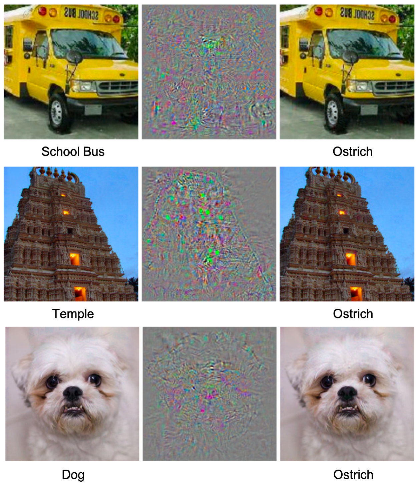
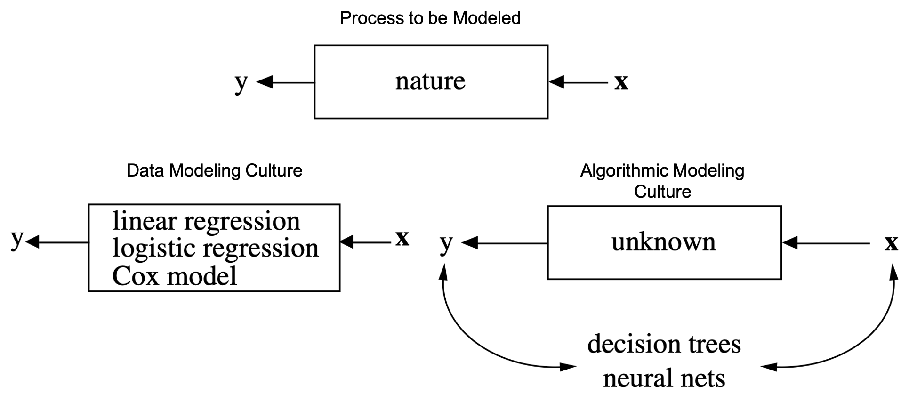
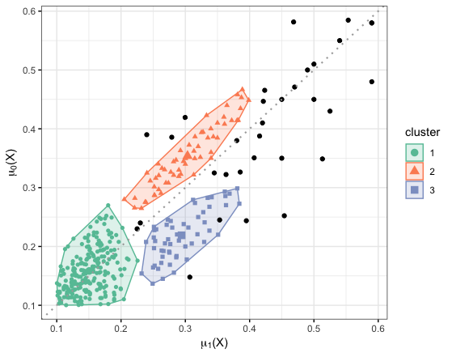
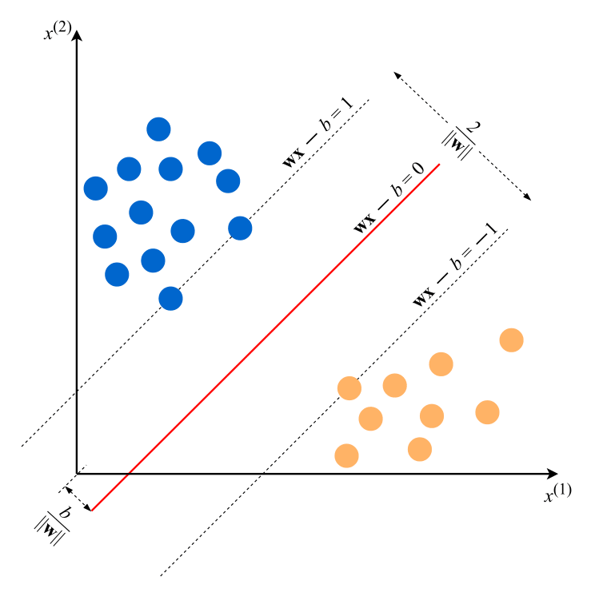
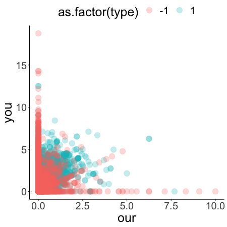
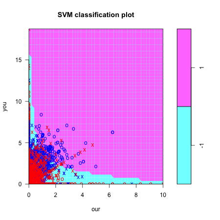
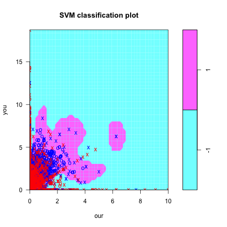
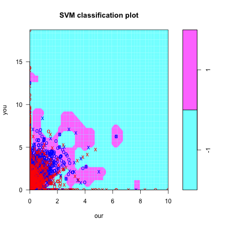
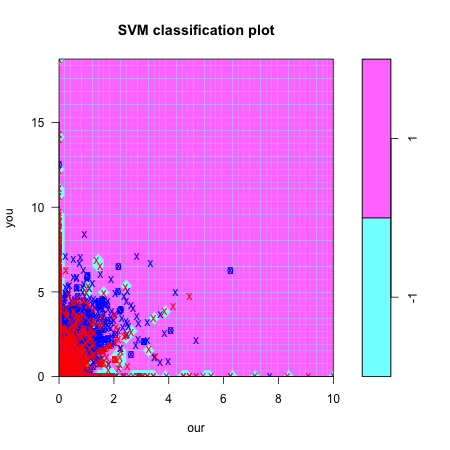

```{r setup, include=FALSE}
knitr::opts_chunk$set(echo = TRUE)

packages <- c( "data.table","tidyverse","ggplot2","ggExtra","gridExtra","skimr","here","Hmisc","RColorBrewer")

for (package in packages) {
  if (!require(package, character.only=T, quietly=T)) {
    install.packages(package, repos='http://lib.stat.cmu.edu/R/CRAN')
  }
}

for (package in packages) {
  library(package, character.only=T)
}

thm <- theme_classic() +
  theme(
    legend.position = "top",
    legend.background = element_rect(fill = "transparent", colour = NA),
    legend.key = element_rect(fill = "transparent", colour = NA)
  )
theme_set(thm)
```


\newpage
\noindent {\Large \bf Outline}
\vskip .25cm
\begin{itemize}
  \item Machines Don't Learn
  \item Data Modeling and Algorithmic Approach
  \item Types of Machine Learning
  \begin{itemize}
    \item Supervised 
    \item Unsupervised 
    \item Semisupervised
    \item Reinforcement
  \end{itemize}
  \item An Example of Supervised Learning: SVMs
\end{itemize}

\newpage
\onehalfspacing

\onehalfspacing

\noindent {\Large \bf Machines Don't Learn}

To quote Andriy Burkov in his great introductory book [@Burkov2019 p4] "Artificial intelligence is not intelligence. Machine learning is not learning." What a typical "learning machine" does is find a math formula which, when applied to collection of inputs (training data), produces outputs [@Burkov2019]. Success is marked by how desirable the outputs are. 

There are (at least) two reasons why this is not "learning". First, the "desirability" of the outputs is usually a very fluid and context specific construct. With ML/AI methods, this fluidity problem is overcome by picking a set of mathematical functions that allow us to define precisely what we mean by "desirable" (e.g., the loss function and the performance metric). The problem is that this is arguably not learning, it's optimizing (i.e., making the model "fit" the data).^[There is an interesting distinction between truth and optimization that is often conflated in scientific analyses, particularly when ML methods are used.]

The second (related) reason is that slightly distorting the inputs can make outputs completely wrong and undesirable. There are a number of great examples of this. One is that of a convolutional neural network named "AlexNet" that was entered into an image classification competition. The creators of AlexNet explored the properties of their algorithm in different scenarios, and they found some interesting things. Figure 1 demonstrates one of these. AlexNet was able to correctly classify many of the images in the database. However, when AlexNet creators made imperceptible but specific changes to these images, AlexNet classified everything as an ostrich!

```{r, out.width = "200px", fig.align='center', fig.cap="Example images from AlexNet, a convolutional neural network for image classification, in original and 'adversarial' settings. Right column displays original images, correctly classified by AlexNet. Middle column displays adversarial changes to select pixels of the image undetectable by human eyes. Right column displays images after adversarial changes, which were all classified as 'ostrich' by AlexNet. Original paper here: https://arxiv.org/pdf/1312.6199.pdf",echo=F}

```

Other examples abound (in fact, if you're interested in buying a self-driving car, you really should look into this!), and they all beg the question: do the machines running these algorithms really "learn"?

Well, what is learning? Learning in humans is an extremely complex phenomenon involving thought (automatic, directed, type 1, type 2), knowledge [personal construction in which an individual imposes **meaning** by relating bits of knowledge, information, and experience into some organizing schemata [@Halpern2014]], communication, language, metaphor, symbolism, bias control (implicit, explicit), transfer of training, metacognition, and many other things. Can machines do this? I believe no, but this is one of the major ongoing debates in AI right now [@Mitchell2019].


So why is it called machine learning? It turns out, because of marketing and hype. Arthur Samuel coined term in 1959 while at IBM to attract clients and employees with the idea of cutting edge feats of technology. What's the relation between machine learning and artificial intelligence? Given the general absence of a precise definition of both ML and AI^[There are generally accepted definitions, but consider the following: AI is a "branch of computer science that studies the properties of intelligence by synthesizing intelligence" [@AI100]; ML is the "automated detection of meaningful patterns in data"], it's hard to pin down the differences between these two areas of research and application. But consider the following: 

1. Historically, ML and AI have different starting points. MLs roots originate in the pattern recognition world. Loosely, pattern recognition consists of taking a dataset, and using an algorithm to discover **generalizable patterns** that can be used for some productive purpose (e.g., inform decisions, better understand the world, automate robots). AI, on the other hand, has its roots in symbolic logic and symbol manipulation. Instead of relying on data, the roots of AI started with computer programs that were written with a particular intent.^[One of the first examples is the General Problem Solver (GPS, but not that one) developed by Herbert Simon and Allen Newell. This program was meant to solve the "Missionary-Cannibal" problem. See page 22 of @Mitchell2019]

2. AI has much clearer and stated mission that is generally divided into two categories: general or strong AI and narrow or specific AI. The objective of general AI is to develop human-level intelligence in a machine. In the field, researchers refer to an AI singularity, where AI will be able to learn by itself, on its own, enabling machines to quickly exceed all aspects of human-level intelligence. In contrast, narrow or specific AI, generally refers to machines that are devoted to doing one specific thing. Examples include Deep Blue (the IBM chess computer), Siri, Cortana, Alexa, risk prediction models, car manufacturing robots, etc.

3. Despite their distinct origins, today ML and AI share a lot in common. Both areas have been heavily influenced by developments in neural networks and deep learning. To my knowledge, ML or AI based on symbol manipulation are no longer in use.

\noindent {\Large \bf Data Modeling and Algorithmic Approach}

Machine learning is often defined as a "subfield of computer science that is concerned with building algorithms which rely on a collection of examples of some phenomenon" [@Burkov2019]. It is often described as the process of solving a practical problem by collecting data and algorithmically building a statistical model based on that dataset.

Both the definition and description invoke the need to collect data or examples used to build an algorithm or model (note how this compares to the definition of ML above, the "automated detection of meaningful patterns in data"). There are several things that should be unpacked here:

1) Perhaps a minor point, but I don't think ML is or should be considered a "subfield" anymore, especially not just of computer science. 

2) What's an algorithm?: "a finite sequence of steps used to solve a problem." The word comes from name of Persian mathematician, al-Khwarizmi. Humans use algorithms everywhere. Cooking recipes, knitting from a pattern, sharpening a knife, starting a campfire, pretty much anything of meaning we do can, in some way, be construed as an algorithmic process [@Christian2016, page 3-4]. 

3) There is a difference between a statistical model and an algorithm, but it's not a simple distinction. Consider the separation between "Two Cultures" that Leo Breiman makes in his now famous article [@Breiman2001]: The data modeling culture, and the algorithmic modeling culture.


```{r, out.width = "250px", fig.align='center', fig.cap="The 'Two Cultures' of Modeling Data, originally in Breiman 2001 Statistical Modeling: The Two Cultures. Stat Sci. 16(3): 199-231",echo=F}

```

The key distinction between these two cultures is this: in the data modeling culture, scientists are specifically interested in unpacking the "black box" that nature uses to relate the variables $\mathbf{x}$ to the outcome $y$. One way this "unpacking" occurs is in the form of estimating parameters for terms in a regression model corresponding to (functions of) the variables in $\mathbf{x}$, informed by background knowledge and subject matter expertise; in contrast, the algorithmic modeling culture simply tries to find any function that "optimally" relates $\mathbf{x}$ to $y$, where optimal is usually defined in terms of some loss function and performance metric.

There is a very important issue hidden away in this distinction of cultures. It deals with the primary aim of science: uncovering the truth about the world. In the data modeling culture, this aim is usually made explicit. In fitting models, scientists will (should) often ask whether the correspondence between the data ($\mathbf{x}$, $y$) and the models used align well enough with what's in nature's black box (See Figure 2). 

Take the following specific example as a case in point. Suppose you conduct an observational study of the effect of some exposure $X$ on some outcome $Y$. In conducting your analysis, you notice that a potential confounder $C$ plays an important role in the analysis. When you adjust for $C$, you estimate that the exposure prevents 10 cases of $Y$ for every 100 individuals in the sample, which is a very strong effect. However, your colleague suggests that, in fact, $C$ is not a confounder, but is a mediator. In this case you should NOT adjust for $C$ and when you don't, you note that the exposure only prevents 2 cases per 100 individuals in the sample (a much smaller and less relevant effect).^[If you're familiar with some of the technial theory behind DAGs, you may recognize this problem as the Markov Equivalence issue. Suppose you have two simple, three-node DAGs, $\mathcal{G}_1$ where $C$ is a confounder (e.g., $X \leftarrow C \rightarrow Y$), and $\mathcal{G}_2$ where $C$ is a mediator (e.g., $X \rightarrow C \rightarrow Y$). It turns out that $\mathcal{G}_1$ and $\mathcal{G}_2$ are Markov equivalent, in that there is no statistical method or algorithm that will allow you to determine whether the data you have were generated from $\mathcal{G}_1$ or $\mathcal{G}_2$.] 

This hypothetical example is all too common in epidemiology and many other disciplines. It is a great example of why knowledge of the black-box (in this case, whether $C$ is a confounder or mediator) matters. Making a choice one way or the other provides you with a very different scientific and policy conclusion, and you cannot avoid making the choice.

The algorithmic modeling culture takes a very different approach to the data modeling culture. This is leading to a lot of confusion (and quite a bit of nonsense). This approach is shown in Figure 2, and basically bypasses the question about what things look like in the black box. In effect, this approach is motivated on the belief that the "inferences" obtained from this algorithmic approach are "model-free". 

But this notion of being "model-free" is only true in a very particular sense. Recall in the causal inference lecture, we discussed correct model specification as an important assumption. Suppose we are interested in the confounder adjusted effect of $X$ on $Y$, and use the following model (introduced in the causal inference section) to estimate this risk difference:

$$ E(Y \mid X, C_1, C_2, C_3, C_4) = \beta_0 + \beta_1 X + \beta_2 C_1 + \beta_3 C_2 + \beta_4 C_3 + \beta_5 C_4 $$

However, suppose that, unbeknownst to us, the correctly specified model would require us to fit the following model


$$ E(Y \mid X, C_1, C_2, C_3, C_4) = \beta_0 + \beta_1 X + \beta_2 C_1 + \beta_3 C_2 + \beta_4 C_3 + \beta_5 C_4 \color{red}{+ \beta_6 C_1C_3 + \beta_7 XC_4} $$

There is some theoretical and simulation evidence to suggest that tree-based methods such as classification and regression trees, random forests, and extreme gradient boosting algorithms can detect the presence of important interactions, such as the terms in red in the above equation [@Su2011; @Schiltz2018; @Meijsen2019]. As such, using tree-based methods increases the chances that we correctly specify the statistical model, whether or not we know explicitly that these interactions are required for improvement. This reduces the burden on the modeler in that they do not have to explicitly include interactions, as would have to be done if we used a parametric (e.g., linear) regression model. **In this sense, the algorithmic approach is model-free in that it does not make strong parametric modeling assumptions.** 

However, as with the previous example, if it turns out that $C_2$, $C_3$, and $C_4$ were mediators and not confounders, then our underlying **causal model** is mis-specified, and both our parametric regression and tree-based methods will give us the wrong answer. Thus, in short, the algorithmic approach can help us with loosening our statistical modeling assumptions, but not our causal modeling assumptions.^[It turns out, however, that loosening our statistical modeling assumptions does not come without a cost. This cost is due to the **curse of dimensionality**, as can be compensated for using doubly robust methods, which we will cover in this course.]

The distinction between a "model-free" and "model-based" inference is the source of a lot of confusion. Some people are not aware of the bypass, or the consequences of the bypass, are conflating the two cultures, and making some pretty ridiculous statements about the role and ability of machine learning, AI, big data, data science, and many of these other modern movements. Consider a particularly egregious example, where authors explicitly claim that, when relying on the algorithmic culture with "big data," it doesn't really matter *why* we might observe an association: "If millions of electronic medical records reveal that cancer sufferers who take a combination of aspirin and orange juice see their disease go into remission, the exact cause for the improvement in health may be less important than the fact they lived” [@Mayer2013, p14]. Nice words. The problem is that this "exact cause" may very well be confounding, selection, information, causal mispecification, or any combination of these biases. 

In general, one cannot conduct etiologic inference without background knowledge: an attempt must be made to unpack the nature box in Figure 2.^[@Robins2001 discusses how etiologic inference rests not only on data and study design, but background knowledge of the processes under study. Limitations in any of these translate directly into limitations in the inferences made.] This is not to say that the algorithmic modeling approach has no role to play in science. It most certainly does, and it has the potential to revolutionize how we do things. One just has to be aware of the motivations, limits, and strengths of these new approaches.

\noindent { \bf Types of Machine Learning}

*Supervised Learning*

Supervised learning is probably most familiar to those with regression experience, because it's basically regression! Essentially, one regresses an outcome (referred to as **labels**) regressed against covariates (or **features**). Their are several ways to motivate supervised learning. One way is to say that the goal of supervised learning is to use data to produce a model that takes features as input and outputs information about labels. This is, by far, the most common type of learning. In this course, we will be focusing almost exclusively on supervised learning algorithms.

*Unsupervised Learning*

Unsupervised learning is an analysis of unlabeled (i.e., no outcome) data. A collection of unlabeled variables is used to create a model that solves "practical problem" such as cluster detection, dimension reduction, or outlier detection.

Consider an example use of unsupervised learning that was implemented by @Kim2020. He used cluster detection to try to discover treatment heterogeneity for the effect of a binary treatment on the risk of a binary outcome. 

```{r unsupervised-plot, out.width = "250px", fig.align='center', fig.cap="Example of unsupervised learning for heterogeneity detection, taken from Kim 2020",echo=F}

```

In Figure \@ref(fig:unsupervised-plot), the $\mu_x$ values on the plot axes are predicted outcome values under $X = 1$ (y-axis) and $X = 0$ (x-axis). These predictions are obtained from an estimated regression model^[ It's important to note that this regression model need not be parametric, such as a linear or logistic model. In fact, using an approach that can properly account for relevant interactions between covariates $\mathbf{V}$ and and $X$ is important for this kind of analysis.] such as:

$$ \mu_x = E(Y \mid X = x, \mathbf{V}), $$
where $\mathbf{V}$ is a set of variables that we think could modify the effect of $X$ on $Y$^[Another important point is that one need not necessarily select these covariates with background knowledge. Certain types of covariate selection algorithms could be used to explore which variables are more important in modifying the effects.].

The $x$ and $y$ axes on this graph in Figure \@ref(fig:unsupervised-plot) represents the estimated counterfactual outcomes under exposure and no exposure, respectively. If there was absolutely no effect of the exposure (sharp null), these points would align perfectly on the diagonal. However, Figure 3 shows some points above (e.g., negative risk difference) and some points below (e.g., positive risk difference).

The clustering algorithm is basically showing the groups of individuals whose effect measure (e.g., risk difference) is the roughly same. For example, the risk difference for the group of observations in the orange cluster is negative, while those in the blue cluster have a positive risk difference.

This is one (of many) examples of where clustering algorithms can be of use.

*Semi-Supervised Learning*

Semi-supervised learning is the same as supervised learning, except that there are more feature vectors (covariates) than there are labeled outputs (outcomes). The rationale is to improve performance of supervised learning model using more feature vectors. The goal is typically to develop an algorithm that predicts outcomes or classifies observations with both missing and observed outcome values. Generally, (informally) the way to do this is train models on complete data, and use these models to predict outcomes for observations without outcomes.

When might you use this approach? There are several case examples, but consider this scenario: you've collected covariate information on millions of observations, but you do not have much outcome data, because it would require a meticulous and time-intensive process. One option is to collect information on a subsample, say a few thousand, observations, and then use semi-supervised learning to predict outcomes for all observations. This is the general approach we took to deal with missing fetal growth measurements [@Naimi2018].

There are really important connections between semi-supervised learning missing outcome data under missing at random (MAR). 

*Reinforcement Learning*

The basis for reinforcement learning rests on the idea that a machine lives in an environment and is capable of perceiving states. This machine can also execute actions that yield different rewards and move the machine into another state. The goal of reinforcement learning is for the machine to learn a "policy," or function that takes feature vector as input (state) and outputs optimal action. Optimal here is usually defined as, e.g., maximizing expected average reward. 

The key is sequential decisions leading to long term goals. One example is self driving cars, where sequential decisions (slow down, turn left, turn right) are made as the result of environmental state inputs (traffic, tire in the road, red light) to achieve a long term goal (get to destination, don't crash!). There is also some work beginning to arise connecting reinforcement learning with optimal dynamic treatment regimes. Optimal dynamic treatment regimes seek to provide an algorithm that optimize an outcome based on past covariate history. There is a natural relation between ODTRs and reinforcement learning, which current research is formalizing [@Tao2018 @Zhang2020].

\noindent { \bf How Supervised Learning Works: Support Vector Machines}

```{r, echo=F, warning=F, message=F, include=F}

library(kernlab)
data(spam)

spam <- as_tibble(spam)

dim(spam)

names(spam)

spam %>% count(type)

```

In this section, we're going to take a first pass at illustrating supervised learning. The specific algorithm we will introduce here is support vector machines with a spam email data example. To keep our discussion grounded, let's use data the `spam` data available in R from the `kernlab` package:

```{r, warning=F, message=F}
library(kernlab)

data(spam)

spam <- as_tibble(spam)

dim(spam)
```

Note these data are not the same as in the book. Rows in this dataset represent emails. The first 48 columns in the dataset contain the frequency of the variable name. For example, the "`r names(spam)[1]`" column is a numeric variable that represents the proportion of times the work "make" appears in the email, relative to all the words in the email. 

If the variable name starts with num (e.g., num650) the it indicates the frequency of the corresponding number (e.g., 650). The variables 49-54 indicate the frequency of the characters ‘;’, ‘(’, ‘[’, ‘!’, ‘\$’, and ‘\#’. The variables 55-57 contain the average, longest and total run-length of capital letters. Variable 58 indicates the type of the mail and is either "nonspam" or "spam".

These data were introduced by Hastie et al [-@Hastie2009]. Here is a reproduction of their Table 1.1, of variables that are most different across spam and nonspam emails:

```{r, warning=F, message=F}
spam %>% group_by(type) %>% summarise(george=mean(george),you=mean(you),
                                      your=mean(your),hp=mean(free),
                                      hpl=mean(hpl),`!`=mean(charExclamation),
                                      our=mean(our),re=mean(re),edu=mean(edu),
                                      remove=mean(remove))
```


\noindent { Basics of SVMs }

Let's use support vector machines to analyze these data, as in the book. First, we'll recode the outcome variable (or label) `type` to be either `+1` ("spam") or `-1` ("not spam"):

```{r}

spam <- spam %>% mutate(type=if_else(type=="spam",1,-1))

spam %>% count(type)

```

The regression equation for a SVM looks like this:

$$ y = \text{sign}({\bf wx} - b) $$
where $y$ is the outcome, in our case either `-1` or `+1`, ${\bf wx}$ is a feature vector and parameters. In our dataset above, ${\bf wx}$ could be rewritten as:

$$ w_1 \times \text{make} + w_2 \times \text{address} +w_3 \times{all} + \ldots + w_{57} \times \text{capitalTotal} - b, $$

\noindent where $w_1$ to $w_{57}$, and $b$ (the intercept) are parameter's we'd like to estimate. The $\text{sign}()$ operator is a function that returns a `-1` if the sign of the argument in the parentheses is negative, and a `+1` otherwise.

The objective of the fitting procedure is to find a set of values for ${\bf w}$ and $b$ that make the output from $\text{sign}({\bf wx} - b)$ as close to the observed values of $y$ as possible. In the book, these values are denoted ${\bf w}^*$ and $b^*$.

Finding the values ${\bf w}^*$ and $b^*$ is an **optimization problem**. An illustration of this optimization problem is given in Figure \@ref(fig:example-svm1):

```{r example-svm1, out.width = "275px", fig.align='center', fig.cap="Basic two-dimensional illustration of support vector machines, taken from Burkov (2019) page 7",echo=F}

```

Below is some code that we can simulate to create a corresponding figure using the `svm` function in the `e1071` package in R:

```{r, message=F, warning=F, include=T}

set.seed(123)
library(e1071)
library(kernlab)

# let's create some data that look like those in Figure 1.1
dat <- as_tibble(data.frame(x1=c(rnorm(9,8,1),rnorm(13,2,1)),
                            x2=c(rnorm(9,3,1),rnorm(13,7,2.5)),
                            y=c(rep(-1,9),rep(1,13))))

dat

# here's a simple svm representation

svm_simple = svm(as.factor(y) ~ ., data = dat, kernel = "linear", scale = FALSE)

svm_simple

# Plot Results

png("../figures/svm_plot2.png", width=450, height=450, units="px")
plot(svm_simple, dat, symbolPalette = c("red","blue"), color.palette = cm.colors)
dev.off()

```

Let's use this basic figure to identify some important concepts behind support vector machines. The first to understand is the maximal margin, which is the space that's centered on the line separating the cases from the noncases. The line separating cases from noncases in the Figure is generally referred to as the separating hyperplane.^[Note we have a line in two dimensions, a plane in three dimensions, and a hyperplane in >3 dimensions.] The margin space is defined as a function of the *support vectors*, which are the points that lie on the dashed lines in Figure \@ref(fig:example-svm1). Support vectors are the datapoints that yield the largest margin between the cases and noncases. 

The objective of the optimization algorithm for a support vector machine is to find the values of $\mathbf{w}$ that separate the cases and the noncases by the largest margin. Because the margin is defined as $\frac{2}{|| \mathbf{w} ||}$, where $|| \mathbf{w} || = \sqrt{\sum_{j=1}^D w_j^2}$, we need to find the smallest values of $\mathbf{w}$ that are compatible with the data. How do we measure compatibility with the data? We can use constraints such as:

\begin{align*}
  \mathbf{wx}_i - b \geq 1 \text{ if } y_i = 1 \text{ and }\\
  \mathbf{wx}_i - b \leq -1 \text{ if } y_i = -1
\end{align*}

In this simple linear example, it's easier to understand the process behind SVMs. The problem is that one would not typically encounter such a clean dataset in real life, where the data points are perfectly separated by a single straight line. So let's look at the spam data to get a more realistic working example. 

Here is a plot similar to the simple example above, but with the $x$ axis representing the frequency of the word "our", and the $y$ axis representing the frequency of the word "you".

```{r,message=F,warning=F,include=T}

p1 <- spam %>% 
  ggplot(.) + 
  theme(text = element_text(size=25)) +
  geom_point(aes(y=you,
                 x=our,
                 group=as.factor(type),
                 color=as.factor(type)),
                 size=5, alpha=.25)

png("../figures/svm_plot3.png", width=450, height=450, units="px")
p1
dev.off()

```


```{r svm-simple2, out.width = "275px", fig.align='center', fig.cap="More complex data for fitting SVMs, showing spam and nonspam emails as a function of the frequency of `our' and `you' in the email.",echo=F}

```

Figure \@ref(fig:svm-simple2) shows a much more complicated relation between the frequency of the words "our" and "you", and whether the email is spam or not. In this particular case, it seems clear that a linear separator will do a very poor job at classifying the emails. Fortunately, there are several other types of (curvi-linear) separators. Two (of many) options are polynomial separator, and the radial basis function separator.

```{r,message=F,warning=F,include=T}

spam2 <- spam %>% select(type,you,our)

svm_polynomial = svm(as.factor(type) ~ ., data = spam2, kernel = "polynomial", gamma = 1, cost = 1)

svm_radial = svm(as.factor(type) ~ ., data = spam2, kernel = "radial", gamma = 1, cost = 1)

# Plot Results
png("../figures/svm_plot4.png", width=450, height=450, units="px")
plot(svm_polynomial, spam2, symbolPalette = c("red","blue"), color.palette = cm.colors)
dev.off()

png("../figures/svm_plot5.png", width=450, height=450, units="px")
plot(svm_radial, spam2, symbolPalette = c("red","blue"), color.palette = cm.colors)
dev.off()

```

In the code above, we fit two different support vector machines. The first uses a **polynomial** separator, and the second uses a **radial basis function**. In the process, we've also introduced two different parameters that we've set equal to one in both cases: **gamma**, and **cost**. The Figures below demonstrate how emails are classified when these two types of separators are used.

```{r, out.width = "275px", fig.align='center', fig.cap="More complex data for fitting SVMs, showing spam and nonspam emails as a function of the frequency of `our' and `you' in the email, classified with a polynomial separator in SVM",echo=F}

```

```{r, out.width = "275px", fig.align='center', fig.cap="More complex data for fitting SVMs, showing spam and nonspam emails as a function of the frequency of `our' and `you' in the email, classified with a radial basis function separator in SVM",echo=F}

```

\newpage

As the names imply, the polynomial separator fits a polynomial curve to the data in order to separate cases from noncases. In the case of the `svm` function from the `e1071` package, the default polynomial is cubic.^[This default can be changed using the `degree` argument in the `svm` function.] Alternatively, the radial basis function encircles to the data to separate cases from noncases. 

With both the polynomial and radial basis functions, the two additional parameters that are important to consider are the `cost` and `gamma` arguments.

The `cost` argument essentially captures the price you want to pay for incorrectly classifying an email. It reflects a penalty for placing outcomes on the wrong side of the line, plane, or hyperplane. The higher the cost, the more careful the algorithm will be at drawing these, but the greater the risk of overfitting the data. We can see this in action if we set `cost=  = 100` and refit the algorithm:

```{r,message=F,warning=F,include=T}

svm_radial = svm(as.factor(type) ~ ., data = spam2, kernel = "radial", gamma = 1, cost = 100)

png("../figures/svm_plot6.png", width=450, height=450, units="px")
plot(svm_radial, spam2, symbolPalette = c("red","blue"), color.palette = cm.colors)
dev.off()

```

```{r, out.width = "275px", fig.align='center', fig.cap="More complex data for fitting SVMs, showing spam and nonspam emails as a function of the frequency of ``our'' and ``you'' in the email, classified with a radial basis function separator in SVM with a cost of 100",echo=F}

```

Gamma is the kernel parameter for the polynomial or radial basis function used to define the line, plane, or hyperplane. In effect, it determines how flexible (or "wiggly") the line, plane, or hyperplane will be. Higher values of gamma result in a closer fit to the data (but incurs a penalty that results from overfitting, which we'll discuss later). We can see this gamma parameter in action if we set `gamma = 100` and refit the algorithm:

```{r,message=F,warning=F,include=T}

svm_radial = svm(as.factor(type) ~ ., data = spam2, kernel = "radial", gamma = 100, cost = 1)

png("../figures/svm_plot7.png", width=450, height=450, units="px")
plot(svm_radial, spam2, symbolPalette = c("red","blue"), color.palette = cm.colors)
dev.off()

```

```{r, out.width = "275px", fig.align='center', fig.cap="More complex data for fitting SVMs, showing spam and nonspam emails as a function of the frequency of ``our'' and ``you'' in the email, classified with a radial basis function separator in SVM with a gamma value of 100",echo=F}

```

These parameters (cost and gamma) are often referred to as hyperparameters or tuning parameters, since they have to be selected, and they determine how well the algorithm will perform. Hyperparameters differ from regular old parameters in that they have to be set for the algorithm to work, instead of simply estimated from the data in the usual way (in fact, they can be "estimated" with data, but this requires some additional work). Hyperparameters are not unique to SVMs, but are generally found in any machine learning algorithm. So naturally an important question arises: what values should one choose to get a good performing algorithm? This question is so important (since sub-optimal selection can lead to disastrous performance), that it's spawned a whole set of ML algorithms and techniques of its own. We will cover one of these methods in some depth in the next section.

# References


\newpage

# References