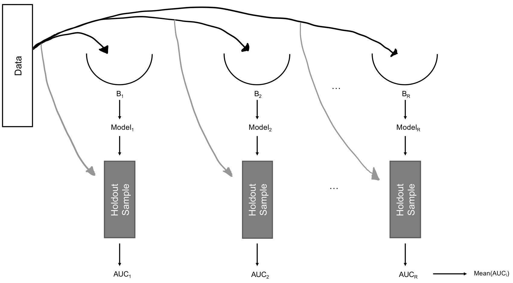
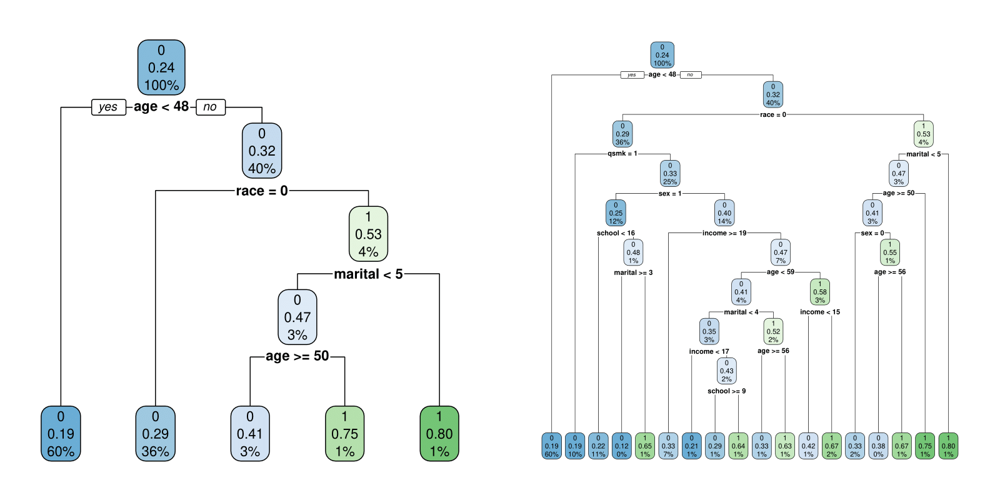
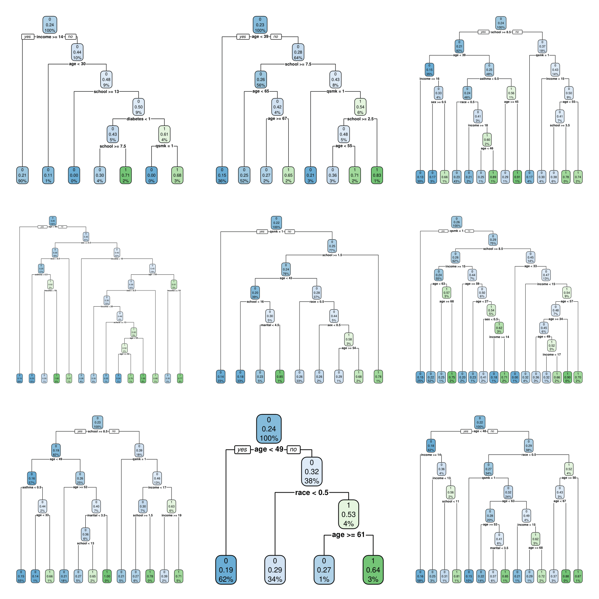

```{r setup, include=FALSE}
library(knitr)
opts_chunk$set(echo = TRUE,  tidy.opts=list(width.cutoff=50), tidy=TRUE)

packages <- c( "data.table","tidyverse","earth",
               "ggplot2","ggExtra","gridExtra",
               "skimr","here","Hmisc","RColorBrewer",
               "rpart","rpart.plot","formatR","Rcpp")

for (package in packages) {
  if (!require(package, character.only=T, quietly=T)) {
    install.packages(package, repos='http://lib.stat.cmu.edu/R/CRAN')
  }
}

for (package in packages) {
  library(package, character.only=T)
}

thm <- theme_classic() +
  theme(
    legend.position = "top",
    legend.background = element_rect(fill = "transparent", colour = NA),
    legend.key = element_rect(fill = "transparent", colour = NA)
  )
theme_set(thm)
```


\newpage
\noindent {\Large \bf Outline}
\vskip .25cm
\begin{itemize}
  \item Predictive Analytics: An Overview
  \item Basic Concepts
  \item Prediction Algorithms
  \begin{itemize}
     \item Classification and Regression Trees
     \item Random Forest
     \item Stacking
  \end{itemize}
\end{itemize}

\newpage
\onehalfspacing

\noindent {\Large \bf Predictive Analytics: An Overview}

Thus far in the course, we've been introduced to the idea of causal inference and some of its nuances, as well as some of the core ideas in machine learning and artificial intelligence. I say *some* because, while ML/AI methods are a very versatile set of tools, they are often conflated for tools used exclusively in the context of predictive modeling. That is, the approach known as "machine learning" is often conflated with a particular purpose (i.e., predictive modeling).

In this section of the course, we will be introduced to the idea of predictive analytics or predictive modeling. Predictive modeling involves the use of data and algorithms^[N.B., I am using the word algorithm here in a comprehensive sense that includes methods that fall in both Breiman's algorithmic and data modeling approaches.] to create a tool that both accurately and precisely predicts the future.

Kuhn and Johnson @Kuhn2018 define predictive modeling as "the process of developing a mathematical tool or model that generates an accurate prediction" (page 1). Predictive modeling has been around for a very very long time, and much of the research on the role of predictive modeling versus clinical expertise has shown the benefits that the former can bring to the latter. Consider, for instance, the initial work in this area by Paul Meehl who, in the 1950s, conducted several studies on the performance of very simple algorithms compared to clinical experts in predicting the longevity of cancer patients, length of hospital stays, diagnosis of CVD, or susceptibility to sudden infant death syndrome. In a commentary written after the publication of his very controversial book [@Meehl2013; @Meehl1986]:

\begin{quote}
When you are pushing 90 investigations, predicting everything from the outcome of football games to the diagnosis of liver disease and when you can hardly come up with half dozen studies showing even a weak tendency in favor of the clinician, it is time to draw a practical conclusion, whatever theoretical differences may still be disputed.
\end{quote}

Similarly, in @Ayres2008 [cited in @Kuhn2018 p 5-6] study of the relation between expert opinion and predictive modeling, he concludes that 

\begin{quote}
"Traditional experts make better decisions when they are provided with the results of statistical prediction. Those who cling to the authority of traditional experts tend to embrace the idea of combining the two forms of 'knowledge' by giving the experts 'statistical support' \ldots Humans usually make better predictions when they are provided with the results of statistical prediction."
\end{quote}

\noindent {\Large \bf Basic Concepts}

When generating a prediction algorithm, it's important to understand a host of concepts central to the practice, as well as potential issues that might arise. In this section, we cover these basic concepts.

To motivate our discussion, we will assume interest in developing a prediction algorithm for preterm birth. Roughly speaking, preterm birth occurs when a fetus is born prior to 37 weeks of gestation. It can be divided into spontaneous and induced preterm birth.^[For our purposes, this distinction will not be important and thus not commented upon.] Preterm birth is one of the most vexing clinical and population health challenges in North America. Roughly 11% of infants born between 20 and 32 weeks gestation in the U.S. do not survive past one year. Those that do face the prospects of life-long complications [@Moster2008; @Tronnes2014]. Preterm birth is among the most disparate health outcomes in United States [@Green2005], with an estimated 60% higher risk of preterm birth for non-Hispanic black compared to non-Hispanic white women in 2013 [@Hamilton2013]--a gap that has persisted for decades [@Culhane2011]. As a result of its longstanding and deleterious presence, interest in tools to identify women at high-risk of preterm birth dates back to at least the mid 1970s [@Fedrick1976].

While the examples we will be using will relate specifically to preterm birth, it's important to note that the general concepts will apply to the creation of any prediction algorithm in any research setting. 

Practice 1: Identify the Purpose of a Given Prediction Algorithm

The first thing to do when constructing a prediction algorithm is to identify the reason for its use. How will a given preterm birth prediction algorithm be used? For example, different sets of information should be considered if a prediction algorithm will be used to identify cases that will undergo cervical cerclage^[A painful and invasive procedure in which the cervix is stiched up to prevent birth from occurring too soon] versus some less invasive approach. For a less invasive management approach, one may seek to develop an algorithm that yields the largest sensitivities and specificities, which would be equivalent to maximizing the area under the ROC curve [@LeDell2016].

Alternatively, cervical cerclage is an invasive procedure that may result in premature contractions, membrane rupture, infection, or premature contractions. Thus, to identify cases that will undergo cerclage, one may prefer an algorithm that maximizes the number of women who will deliver preterm that get classified as preterm births (high sensitivity), but minimizes the number of women who will not deliver preterm and get classified as preterm births (fewest false positives). This would lead to the most optimal allocation of the drug, in terms of both effective use and cost.

Maximizing sensitivity and minimizing false positives is a strategy that was employed for the cost effective allocation of pre-exposure prophylactics among potential HIV seroconverters [@Zheng2018]. These researchers used custom optimization programs with the SuperLearner package in R [@vanderLaan2007] to maximize sensitivity and minimize false positives.

Practice 2: Identify the Context of a Given Prediction Algorithm

For a particular algorithm to be beneficial, one must articulate the context in which it can later be used. Will the algorithm be used once before conception, once early on in the gestational period, at the 36th week among high risk women, or many times throughout gestation? Clarifying such decisions is critical. Not only do these decisions dictate which data will be needed to properly develop and train the algorithm, but they inform future users of the gestational periods in which the performance of the algorithm is supported by data, and where one must rely on extrapolation to warrant the algorithm’s use. 

For example, fetal breathing movements, cervical length and funneling, amniotic fluid IL-6, and serum C-reactive protein have been identified as promising candidates for predicting spontaneous preterm birth among symptomatic women within 2 to 7 days of testing [@Honest2012]. However, these studies generally did not provide information on the gestational age(s) in which the tests were applied. It is therefore not possible to determine whether these tests will perform well generally across gestation, or specifically within the gestational window(s) in which they were administered in these studies.

Practice 3: Consider the Range of Analytic Methods Available

The last two decades have seen an explosion in the development of prediction methods, including regression based and more complex machine learning techniques [@Hastie2009; @Berk2008] Generally, methods available to researchers for predicting preterm birth fall into two classes: solitary and ensemble methods. A solitary learner consists of a single method, such as logistic regression, support vector machine, or classification and regression tree, fit to the data to generate a predictive algorithm. In contrast, ensemble learners consist of a grouping of solitary methods. The simplest example of an ensemble learner is a random forest, in which several classification and regression trees are fit to a single dataset, and combined into a single algorithm. A more complex example is a stacked generalization (or stacking, or the Super Learner).[24, 25] We have already seen SVMs. We will cover several other methods in the next section.

Practice 4: Honest Training and Validation 

One critically important area that researchers often fail to consider is the evaluation of a given algorithm. Ultimately, the usefulness of any prediction algorithm depends on how well it performs. Unfortunately, it is relatively easy to develop an algorithm that performs exceedingly well in a study (e.g., high sensitivity and specificity), but may subject to serious issues in practice. Proper steps must be taken to protect the assessment of an algorithm from yielding misleading performance results. 

A key principle to consider in the evaluation of any algorithm is the **firewall principle** [@Mullainathan2017]: 

\begin{quote}
no data used to estimate the model that will generate the predictions should be used to evaluate the predictive performance of that model. 
\end{quote}

To properly evaluate any algorithm, one must first create a hold-out sample (a sample removed from model estimation) before any analysis or algorithm development begins. Most often, the hold-out sample is a randomly chosen subset (often between 10% - 30% of the original data) [@Kuhn2018] However, it is not always possible to set aside such a proportion of data, particularly when the sample size is small. In such a setting, an alternative approach is to use cross-validation or bootstrapping.

Cross-validation proceeds by splitting the data into $k$ different partitions. While $k$ is usually taken to be between 5 and 10, the smaller the dataset, the larger k should be [@Naimi2018a]. One then proceeds to fit the prediction algorithm to the data $k$ times. For each of the $k$ analyses, one of the partitions is removed. This partition is the testing sample. The remaining $k – 1$ partitions, referred to as the training sample, are used to estimate (or train) the models. Once the models are fit in the training sample, the testing sample is used to generate the performance measure (e.g., sensitivity, specificity, or positive and negative predictive values). The chosen measure obtained from each of the $k$ analyses is then averaged together to obtain an overall measure of the performance of the prediction algorithm. This procedure is depicted in Figure \@ref(fig:cross-val), which shows the process by which cross-validation can be used to generate average performance measures.

```{r cross-val, out.width = "275px", fig.align='center', fig.cap="With five-fold cross validation, data are split into five partitions and five analyses are conducted. In the first analysis, the first partition is left out of the analysis. Algorithms are fit to partitions 2-4, and predictions are obtained in partition 1. These predictions are then compared to the observed data to obtain an algorithmic performance measure (in this example, AUC). This process is repeated four more times, and performance measures are averaged across all five runs.",echo=F}
knitr::include_graphics("../figures/cross-val.png")
```

Alternatively, one may use bootstrap aggregation (Figure \@ref(fig:bagging)), in which all data are resampled with replacement $R$ times. Larger $R$’s are better, with the smallest number of resamples being between 100 to 500. Bootstrap aggregation proceeds by first resampling the data. Any time a bootstrap resample is taken, there are individuals in the original data that are not in the resample. With bagging, these individuals are referred to as the "out-of-bag" sample, and this constitutes the holdout sample in a bagged estimator. 

The algorithm is then fit bootstrap resample, and performance measures are obtained with the out-of-bag sample. This process is repeated in all R resamples, and performance measures are averaged across all R resamples.

```{r bagging, out.width = "275px", fig.align='center', fig.cap="With bootstrap aggregation (bagging), the training data are resampled (with replacement) R times, and R analyses are conducted. For each resample, a model is created. This model is then used to in the holdout data to obtain an algorithmic performance measure (in this example, AUC). The performance measures from the holdout sample obtained from each of the R models are averaged.",echo=F}

```

Without some form of hold-out sample, either by setting aside a portion of the data, or (in smaller samples) relying on cross-validation or bagging, it is not possible quality of a given predictive algorithm, since the firewall principle has been broken. Even if the study suggests high sensitivity, specificity, AUC, or other performance measures, in actual fact, this may be the result of the fact that the same observations were used to both fit and validate the model. In such settings, great in-sample performance may actually indicate poor out-of-sample performance.

\noindent {\bf CART}

Now that we've covered some general aspects of predictive modeling, let's get into some specific algorithms. Classification and regression trees are one approach, and were first introduced by Brieman, Friedman, and Stone [@Brieman1983]. They are (to my knowledge) the simplest tree-based algorithms available. 
Trees are classification based when the outcome being quantified is a binary/categorical variable and we want to predict that category. In such a case, the prediction model is a probability model. On the other hand, they are regression-based when the outcome is continuous and the conditional expectation is being predicted. 

The basic idea behind classification and regression trees is to split the outcome data into groups on the basis of the predictors. The algorithm proceeds as follows: first, a single variable is found which **best** splits the data into two groups. The data are separated, and the splitting occurs again, separately in each group. The process is then again repeated recursively until the
subgroups either reach a minimum user-defined size (e.g., no less than 5 in each group) or until no **improvement** can be made.

Here, the words "best" and "improvement" are mathematically defined through an **impurity** measure. The split that maximizes impurity is defined as the "best". Change in impurity prior to and proceeding any given split is what is used to define whether a split improves the fit. For example, for a binary outcome, several impurity measures can be defined, among them being the Gini-based impurity measure:

$$ \text{Gini}(t) = 1 - \sum_{y = 0}^1 [p(y \mid t)]^2 $$

Any split that leads to a decrease in $\text{Gini}(t)$ is deemed to improve the fit. 

The primary package that enables us to implement CART in R is the `rpart` package^[The natural function would have been `cart()`. However, early authors trademarked the name, forcing those who developed software to seek alternative names. The `rpart` package stands for recursive partitioning, which is what classification and regression trees do.]:

```{r}
install.packages("rpart",repos="http://lib.stat.cmu.edu/R/CRAN/")
library(rpart)
packageVersion("rpart")

install.packages("rpart.plot",repos="http://lib.stat.cmu.edu/R/CRAN/")
library(rpart.plot)

```

Along with the `rpart` package, there is a "kyphosis" dataset used to illustrate the function. These data come from a study of children who have had spinal surgery to correct a curvature known as kyphosis:
```{r}
## load the data
data("kyphosis")

## dimensions of data
dim(kyphosis)

## first six observations
head(kyphosis)

## structure of data
str(kyphosis)
```
In these data, `kyphosis` is a factor indicator of whether kyphosis was present or absent; `age` represents age in months; `number` represents the number of vertebrae that were operated on; and `start` represents the number of the topmost vertebra operated on. To predict kyphosis as a function of these variables, we can use a classification and regression tree:

In the first model, we use the default tuning parameter values:
```{r}
fit <- rpart(Kyphosis ~ Age + Number + Start, data = kyphosis, method="class")
```

```{r, out.width = "300px", fig.cap="Classification and regression tree fit from the kyphosis data using default tuning parameters", echo = FALSE} 
rpart.plot(fit, extra=1)
```

This figure shows that there are two variables that predict kyphosis: which vertebra is the topmost vertebra (start) and age.^[The figure was obtained using rpart.plot via `rpart.plot(fit, extra=1)`] The most predictive is start: having surgery on a vertebra at or greater than the 9th from the top. If the child's surgery included vertebrae at or greater than the 9th from the top, the next most predictive is whether the surgery involved vertebrae at or greater than the 15th from the top. Among those whose surgery invovled a vertebrae at or greater than the 15th from the top, the next most predictive is age (<55 months) and age again (< 111 months).

This figure is effectively what is returned by classification and regression tree. However, this is not the **only** implementation. There are several tuning parameters one can change to slightly alter the tree. For the `rpart` function, the tuning parameters of importance are encoded in the `rpart.control` function, and include:
\begin{table}[h]
\caption{Select tuning parameters for the `rpart` function in R. Source: R help.}
\begin{center}
\begin{tabular}{lp{2.5cm}p{5cm}}
& & \\
\hline
Parameter & Default & Interpretation \\
\hline \hline
minsplit & 20 & minimum number of observations in a node for a split to be attempted \\
minbucket & round(minsplit/3) & minimum permitted number of observations in any terminal node \\
cp & 0.01 & complexity parameter, which is a function of the chosen impurity index. A threshold factor above which a split is deemed "unimportant". \\
xval & 10 & number of cross validations. \\
maxdepth & 30 & maximum depth of any node in the final tree. \\
\hline
\end{tabular}
\end{center}
\end{table}

\newpage

We can explore what happens to the fit of the model when these parameters are changed. For example, we can change the complexity parameter from its default of 0.01 to 0.05, thus favoring a simpler model:

```{r}
fit <- rpart(Kyphosis ~ Age + Number + Start, data = kyphosis, method="class", control = rpart.control(cp = 0.05))
```

```{r, out.width = "150px", fig.cap="Classification and regression tree fit from the kyphosis data using a complexity parameter of 0.05", echo = FALSE} 
rpart.plot(fit, extra=1)
```

On the other hand, we can get extremely flexible, and fit a model with tuning parameters that are highly flexible:

```{r}
fit <- rpart(Kyphosis ~ Age + Number + Start, data = kyphosis, method="class", control = rpart.control(cp = 0.001,minsplit = 5,minbucket=4))
```

```{r, out.width = "300px", fig.cap="Classification and regression tree fit from the kyphosis data using tuning parameters that yield a highly flexible model", echo = FALSE} 
rpart.plot(fit, extra=1)
```

This much more flexible model leads (as expected) to a much richer tree. But this is not necessarily better. In fact, we are more than likely overfitting the data here. 

The number of options that we can modify can keep us very busy. But a more important question is which specification of the tuning parameters is better? There is actually no way to tell. However, we will see how stacking (Super Learner) can help us answer this question.

\noindent {\Large \bf CART Performance}

When they were introduced, it was quickly realized that classification and regression trees were a powerful tool for exploring data and making predictions. Relative to other prediction algorithms (e.g., principal component analysis, partial least squares), trees are not affected by transformations (e.g., centering and scaling) of the predictors. They are immune to the effects of predictor outliers. Unlike logistic regression, they do not require complex link functions for binary outcomes. Unlike neural networks, the relation between the predictors and the outcome is relatively easy to understand. Finally, trees are easy to use because they can be directly applied to data without requiring complex transformations to optimize predictive validity [@Hastie2009, (p352)].

However, it was also soon realized that trees suffered from an important problem: relatively low accuracy.^[For classification trees, accuracy is captured via a confusion matrix. For regression, accuracy is defined as mean squared error.] The problem is that trees tend to grow too deep and learn highly irregular patterns: they overfit (i.e., undersmooth) the data. In other words, CART tends to have low bias, but very high variance. 

This problem results from the fact that trees tend to encode highly irregular features of the data under a wide range of tuning parameters. We can visualize this effect by fitting a CART model to the NHEFS data under the default tuning parameters and a moderate decrease in the complexity parameter. In this classification tree, we are trying to predict high blood pressure (`high_BP`) as a function of `qsmk, sex, age, race, income, marital, school, asthma, bronch, diabetes`.

```{r, out.width = "300px",fig.cap="Classification and Regression Tree Algorithms fit to the NHEFS Data with a complexity parameter of 0.01 (left panel) and 0.0075 (right panel).",echo=F}

```

As displayed in Figure 1, as soon as we lower the complexity parameter from its default by even a little amount, the number of "important" features captured by the CART tree jumps from 3 to 14. Indeed, it is very easy to create highly complex trees that fit the data at hand nearly perfectly. But in doing so, we lose the ability to make scientific generalizations from our models, which is primarily why we would do the analysis. 

Soon after CART was introduced, several researchers began to make modifications to the algorithm to make it more robust to overfitting. The two that were shown to have the most important impacts on the performance of a tree were bootstrap aggregating (bagging) and the random subspace method.

\noindent {\Large \bf Bootstrap Aggregation} 

Bootstrap aggregation, or bagging, is a simple technique meant to reduce the variability of a flexibly specified classification and regression tree. The basic premise starts with a bootstrap sample of the original data. For example, suppose we let $X$ represent all (outcome and covariates) of the NHEFS data that we are using to fit a CART model. Suppose further that we let $\text{Tree}(X)$ represent the tree fit to these data (i.e., as in Figure 1, left panel). We can take $B$ bootstrap samples from $X$, which we denote $X_1, X_2, \ldots X_B$, which gives us a total of $B$ trees. This multiplicity of trees is why we call the approach random forests. 

Going back to the NHEFS data example, we can take nine bootstrap resamples and fit a flexible CART model to each resample, giving us a total of nine trees:

```{r, out.width = "300px",fig.cap="Nine Classification and Regression Tree Algorithms fit to bootstrap resamples of the NHEFS Data under default tuning parameters.",echo=F}

```

\newpage

Note the variation in the structure of these trees, which is an indication of how sensitive CART is to (here relatively minor) pertubartions in the data. This variation is not of direct interest, in the sense that we do not use the bootstrap to quantify confidence intervals. Rather, random forests rely on the bootsrtap to obtain numerous trees, which are then averaged over to get a single prediction. By taking the average of several trees fit to the same data, bagging is better able to deal with the volatility inherent in CART to yield a better performing algorithm.

Mathematically, we can write that a random forest is simply an aggregation of bootstrapped trees:

$$ \text{RF} = \frac{1}{B} \sum_{b = 1}^B \text{Tree}(X_b) $$

It is the averaging of numerous trees that results in a better performance of the random forest over CART. To give a more precise illustration of the mechanism here, consider the trees in Figure 2. Consider further that we might be interested in predicting the probability of high blood pressure if everyone quit smoking. From each tree, we would obtain the predicted probability of high blood pressure if `qsmk=1`, giving us a total of nine predictions, from which we would compute the average.^[Note that for some trees, the prediction doesn't change since `qsmk` is not in the tree.] For a classifiation algorithm, the final prediction (i.e., whether a person has high BP or not) will be based on the "majority vote" of all 
Another benefit of using the bootstrap in this context is that we have a way of estimating the error in the algorithm. This error is calculated as follows:

\begin{itemize}
\item[] Step 1: Compare the observations in each of the $B$ bootstrapped trees to the observations in the original sample. From all $B$ trees, select only those that do not have the first observation in the original sample. These trees are referred to as "out of bag" trees.
\item[] Step 2: Predict the event using only the out of bag trees.
\item[] Step 3: Take the difference of the out-of-bag prediction and the actual outcome for the first observation.
\item[] Step 4: Repeat for all $N$.
\item[] Step 5: Take the mean of all $N$ errors.
\end{itemize}

The end result from this process is referred to as the out-of-bag error. But why is it important? First, the OOB error gives an idea of how "close" the forest predictions are to the actual predictions. Second, @Brieman1996 showed that the out-of-bag error is as accurate as doing a formal analysis with a testing and validation set (e.g., cross-validation, which we will discuss later). As a result, one need not actually use formal testing/validation with random forests.

\noindent {\Large \bf Random Subspace Selection} 

A second feature of random forests is the use of random subspace selection, which works as follows: Instead of using **all available covariates** when fitting each tree to the bootstrapped data, the algorithm randomly chooses only a subset of the predictors. What this does is it reduces the correlation between each of the bootstrapped trees, thus allowing us to compute error rates without accounting for violations of the IID assumption.^[Recall, the independent and identically distributed (IID) assumption is required for the validity of most estimation methods, including the mean estimator, which is used to compute the OOB error.] It also tends to reduce the impact of a variable that is so highly predictive that it would force the tree to overfit the data whenever it is included in the tree. Thus, by repeated the fitting process a large number of times the overfitting induced by these highly predictive variables is minimized. 

\noindent {\Large \bf Random Forests via `ranger`} 

In R, there are several implementations of the random forest algorithm for a wide range of data. These include `RandomForest` and `ranger`, which implement more "classical" random forests (i.e., for regression and classification), as well as `quantregForest` and `randomForestSRC`, which implement versions that predict quantiles of a distribution (e.g, survival curves), and not just the expected value. 

Arguably, (IMO) the `ranger` package is the best of these given its speed and simplicity. To install `ranger`, we use the standard approach:

```{r}
install.packages("ranger",repos="http://lib.stat.cmu.edu/R/CRAN/")
library(ranger)
```

We will use this function to predict whether an individual case will have high blood pressure in the NHEFS data:^[These are the same data we used for the g Computation example]

```{r}

a <- fread("../data/gComp_example.csv")
names(a)

a <- a %>% select(high_BP, qsmk, sex, age, race, income, marital, school,asthma,bronch,diabetes) %>% na.omit()
a$qsmk <- as.factor(a$qsmk)
dim(a)

```

In the `ranger` function, there are several options that we should be aware of. These options are effectively tuning parameters that will change the behaviour of the algorithm. Among them include:
\begin{table}[h]
\caption{Select tuning parameters for the `ranger` function in R. Source: R help.}
\begin{center}
\begin{tabular}{lp{2.5cm}p{5cm}}
& & \\
\hline
Parameter & Default & Interpretation \\
\hline \hline
num.trees & 500 & Number of bootstraps from the data; the size of the forest \\
mtry & round($\sqrt{p}$) & Number of variables randomly selected for subspace (where $p$ is total number) \\
importance & none & Whether a variable importance measure will be computed. \\
splitrule & gini/variance & Impurity measure used to determine whether a split should occur \\
min.node.size & 1 & Smallest number of observations in each node. \\
probability & F & For binary outcomes, determines whether probability or classificaiton should be computed.\\
quantreg & F & For continuous outcomes, determines whether quantile forest should be fit. \\
\hline
\end{tabular}
\end{center}
\end{table}

To implement `ranger`, we can use the following code:

```{r}

rF <- ranger(as.factor(high_BP) ~ .,data=a)

```

Note that the `y ~ .` notation in the above code is telling `R` to regress `y` against all variables in the dataset.^[note also that we can do this for all functions in R that take a formula, including `lm()` and `glm()`.] Note also that for this to work, **we had to code our outcome as a factor.** If we don't the `ranger` function will run a regression, and not classification model. If we call the ranger object, we get important information on the algorithm:
```{r}
rF
```

From this object, we can get predicted values and compare them to the actual values:

```{r}

prediction <- predict(rF,data=a)
names(prediction)
prediction <- prediction$predictions
table(a$high_BP,prediction)

```

\noindent {\Large \bf Stacking via Super Learner} 

All of the examples above represent implementations of single algorithms under a specific set of tuning parameters. However, selecting appropriate set of tuning parameters can make or break the performance of an algorithm. Furthermore, there will always be the question of which particular algorithm one should use? 

In the early 1990s, Wolpert developed an approach to combine several ``lower-level'' predictive algorithms into a ``higher-level'' model with the goal of increasing predictive performance [@Wolpert1992]. He termed the approach ``stacked generalization'', which later became known as ``stacking''. Later, Breiman demonstrated how stacking can be used to improve the predictive accuracy in a regression context, and showed that imposing certain constraints on the higher-level model improved predictive performance [@Breiman1996]. More recently, van der Laan and colleagues proved that, in large samples, the algorithm will perform at least as well as the best individual predictor included in the ensemble [@vanderLaan2003;vanderLaan2006a;vanderLaan2007]. Therefore, choosing a large library of diverse algorithms will enhance performance, while creating the best weighted combination of candidate algorithms will further improve performance. Here, best is defined in terms of a bounded loss function, which allows us to define and quantify how well a given algorithm (e.g., regression, machine learning) performs at predicting or explaining the data. Over-fitting is avoided with $V$-fold cross-validation. In this context, the term "Super Learner" was coined.

Super Learner has tremendous potential for improving the quality of predictions in applied health sciences, and minimizing the extent to which empirical findings rely on parametric modeling assumptions. The following introduction is taken from @Naimi2018a. Full \texttt{R} code for these examples is available at \href{https://github.com/ainaimi/SuperLearnerIntro}{GitHub}.

\section*{Example 1: Dose-Response Curve}

For 1,000 observations, we generate a continuous exposure $X$ by drawing from a uniform distribution with a minimum of zero and a maximum of eight and then generate a continuous outcome $Y$ as
\begin{equation}
	Y = 5 + 4\times\sqrt{9 X}\times \mathbb{I}(X<2) + \mathbb{I}(X\geq 2)\times(|X-6|^2) + \epsilon,
\end{equation}
where $\mathbb{I}()$ denotes the indicator function evaluating to 1 if the argument is true (zero otherwise), and $\epsilon$ was drawn from a doubly-exponential distribution with mean zero and scale parameter one.  
The true dose-response curve is depicted by the black line in Figure \@ref{F1}. 
We now manually demonstrate how  Super Learner can be used to flexibly model this relation without making parametric assumptions.

```{r F1, out.width = "275px", fig.align='center', fig.cap="Dose-response curves for the relation between our simulated continuous exposure and continuous outcome in Example 1. The black line represents the true curve, while the red and blue lines represent curves estimated with the programmed Super Learner package in R, and the manually coded Super Learner. Light blue and green curves show the fits from the level-zero algorithms, \texttt{earth} and \texttt{gam} respectively. Gray dots represent observed data-points.",echo=F}
knitr::include_graphics("../figures/figure1.png")
```

To simplify our illustration, we consider only two "level-zero" algorithms as candidates to the Super Learner library: generalized additive models with 5-knot natural cubic splines (\texttt{gam}) [@Hastie1990] and multivariate adaptive regression splines implemented via the \texttt{earth} package [@Milborrow2017]. In practice, a large and diverse library of candidate estimators is recommended. Our specific interest is in quantifying the mean of $Y$ as a (flexible) function of $X$. To measure the performance of candidate algorithms and to construct the weighted combination of algorithms, we select the $L$-2 squared error loss function $(Y-\hat{Y})^2$ where $\hat{Y}$ denotes  our predictions. Minimizing the expectation of the $L$-2 loss function is equivalent to minimizing mean squared error, which is the same objective function used in ordinary least squares regression [@Hastie2009]$^{\text{(section 2.4)}}$. To estimate this expected loss, called the ``risk'', we use $V$-fold cross-validation with $V=5$ folds. Cross-validation is a sample splitting technique to assess estimator performance using data drawn from the same distribution. As detailed below, each candidate estimator is fit on a portion of the data and used to predict the outcomes for observations that were not used in the training process. As a result, cross-validation helps us avoid poor out-of-sample predictions and gives us a more honest measure of performance. Without this crucial step, we risk generating a predictive algorithm that performs flawlessly for the data at hand, but poorly for another sample. To implement Super Learner, we:

\begin{description}
\item[Step 1.] Split the observed ``level-zero'' data into $5$ mutually exclusive and exhaustive groups of $n/V=1000/5 =200$ observations. These groups are called ``folds''.

\item[Step 2.] 
For each fold $v=\{1, \ldots, 5\}$, 
\begin{enumerate}
	\item[a.] Define the observations in fold $v$ as the validation set, and all remaining observations (80\% of the data) as the training set. 
	\item[b.] Fit each algorithm on the training set. 
	\item[c.] For each algorithm, use its estimated fit to predict the outcome for each observation in the validation set. Recall the observations in the validation set are not used train each candidate algorithm.
	\item[d.] For each algorithm, estimate the risk. For the $L$-2 loss, we  average the squared difference between the  outcome $Y$ and its prediction $\hat{Y}$ for all observations in the validation set $v$. In other words, we calculate the mean squared error (MSE) between the observed outcomes in the validation set and the predicted outcomes based on the algorithms fit on the training set. 
	\end{enumerate}

\item[Step 3.]
Average the estimated risks across the folds to obtain one measure of performance for each algorithm. In our simple example, the cross-validated estimates of the squared prediction error are 2.58 for \texttt{gam} and 2.48 for \texttt{earth}.

At this point, we could simply select the algorithm with smallest cross-validated risk estimate (here, \texttt{earth}). This approach is sometimes called the Discrete Super Learner. Instead, we combine the cross-validated predictions, which are referred to as the "level-one" data, to  improve performance and build the "level-one" learner. 

\item[Step 4.]
Let $\hat{Y}_{\text{gam-cv}}$ and $\hat{Y}_{\texttt{earth-cv}}$ denote the cross-validated predicted outcomes from \texttt{gam} and \texttt{earth}, respectively. Recall the observed outcome is denoted $Y$. To calculate the contribution of each candidate algorithm to the final Super Learner prediction, we use non-negative least squares to regress the actual outcome against the predictions, while suppressing the intercept and constraining the coefficients to be non-negative and sum to 1:
\begin{equation}
	\mathbb{E}(Y | \hat{Y}_{\text{gam-cv}}, \hat{Y}_{\text{earth-cv}}) = \alpha_1\hat{Y}_{\text{gam-cv}} +  \alpha_2\hat{Y}_{\text{earth-cv}},
\end{equation}
such that $\alpha_1\geq 0$; $\alpha_2 \geq0$, and $\sum_{k=1}^2 \alpha_k=1$. Combining the $\hat{Y}_{\text{gam-cv}}$ and $\hat{Y}_{\text{earth-cv}}$ under these constraints (non-negative estimates that sum to 1) is referred to as a ``convex combination,'' and is motivated by both theoretical results and improved stability in practice [@Breiman1996; @vanderLaan2007] Non-negative least squares corresponds to minimizing the mean squared error, which is our chosen loss function (and thus, fulfills our objective). We then normalize the coefficients from this regression to sum to 1. In our simple example, the normalized coefficient values are $\hat{\alpha}_1=0.387$ for \texttt{gam} and $\hat{\alpha}_2=0.613$ for \texttt{earth}. Therefore, both generalized additive models and regression splines each contribute approximately 40\% and 60\% of the weight in the optimal predictor.

\item[Step 5.]
The final step is to use the above weights to generate the Super Learner, which can then be applied to new data ($X$) to predict the continuous outcome. To do so, re-fit \texttt{gam} and \texttt{earth} on the entire sample and denote the predicted outcomes as $\hat{Y}_{\text{gam}}$ and $\hat{Y}_{\text{earth}}$, respectively.  Then combine these predictions with the estimated weights from Step 4:
\begin{equation}
	\hat{Y}_{\text{SL}} = 0.387 \hat{Y}_{\text{gam}} + 0.613  \hat{Y}_{\text{earth}}
\end{equation}
where $\hat{Y}_{\text{SL}}$ denotes our final Super Learner predicted outcome.
The resulting predictions are shown in blue in Figure \@ref{fig:F1}. For comparison, the predictions  from the \texttt{R} package \texttt{SuperLearner}-v2.0-23-9000 are shown in red [@Polley2016] while the predictions from \texttt{gam} and \texttt{earth} are shown in light blue and green, respectively.

\end{description}

\section*{R Code for Example 1: Dose-Response Curve}

```{r, warning=F, message=F}
library(SuperLearner);library(data.table);library(nnls);library(rmutil)
library(ranger);library(xgboost);library(splines);library(Matrix)
library(ggplot2);library(xtable)

# EXAMPLE 1
# set the seed for reproducibility
set.seed(12345)

# generate the observed data
n=1000
x = runif(n,0,8)
y = 5 + 4*sqrt(9 * x)*as.numeric(x<2) + as.numeric(x>=2)*(abs(x-6)^(2)) + rlaplace(n)

# to plot the true dose-response curve, generate sequence of 'doses' from 0 to 8 at every 0.1,
#	then generate the true outcome
xl<-seq(0,8,.1)
yl<-5 + 4 * sqrt(9 * xl)*as.numeric(xl<2) + as.numeric(xl>=2)*(abs(xl-6)^(2))

D<-data.frame(x,y)  	# observed data
Dl<-data.frame(xl,yl)   # for plotting the true dose-response curve

# Specify the number of folds for V-fold cross-validation
folds= 5
## split data into 5 groups for 5-fold cross-validation 
## we do this here so that the exact same folds will be used in 
## both the SL fit with the R package, and the hand coded SL
index<-split(1:1000,1:folds)

learners = create.Learner("SL.gam", params = list(deg.gam = 5))

learners

#create.SL.gam(deg.gam = 5)
#create.SL.nnet(size=4)

# Specifying the SuperLearner library of candidate algorithms
sl.lib <- c(learners$names,"SL.earth")

# Fit using the SuperLearner package, specify 
#		outcome-for-prediction (y), the predictors (x), the loss function (L2),
#		the library (sl.lib), and number of folds 
fitY<-SuperLearner(Y=y,X=data.frame(x), method="method.NNLS", SL.library=sl.lib,cvControl=list(V= folds,validRows=index))

# View the output: 'Risk' column returns the CV-MSE estimates
#		'Coef' column gives the weights for the final SuperLearner (meta-learner)
fitY

```

\section*{Example 2: Binary Classification}

Our second example is predicting the occurrence of a binary outcome with goal of maximizing the area under the receiver operating characteristic (ROC) curve, which shows the balance between sensitivity and specificity for varying discrimination thresholds. For 10,000 observations, we generate five covariates $\mathbf{X}=\{X_1, \ldots, X_5\}$ by drawing from a multivariate normal distribution and then generate the outcome $Y$ by drawing from a Bernoulli distribution with probability 
\begin{equation*}
	\begin{split}
			\mathbb{P}( Y = 1 \mid \mathbf{X}) = 1 - \expit \big \{ \beta_0 + \beta_1X_1+ \beta_2X_2 & + \beta_3X_3+ \beta_4X_4+ \beta_5X_5 \\ & + \boldsymbol{\beta}_1(X_1:X_5)_1 + \boldsymbol{\beta}_2(X_1:X_5)_2 \big \},		
	\end{split}
\end{equation*}
where  $\expit(\bullet)=(1+\exp[-\bullet])^{-1}$; and $(X_1:X_5)_1$ and $(X_1:X_5)_2$ denote all first and second order interactions between $X_1, \ldots, X_5$, respectively; and  $\boldsymbol{\beta}_1$ and $\boldsymbol{\beta}_2$ denote a set of parameters, one for each interaction. In total, there were 25 terms plus the intercept in this model. The intercept was set to $\beta_0 = 2$, while all other parameters were drawn from a uniform distribution bounded by 0 and 1. 

 Our library of candidate algorithms consists of Bayesian GLMs (\texttt{bayesglm)}, implemented via the \texttt{arm} package (v 1.9-3) [@Gelman2016], and multivariate polynomial adaptive regression splines (\texttt{polymars)} via the \texttt{polspline} package [@Kooperberg2015]. Our objective is to generate an algorithm that correctly classifies individuals given covariates. Correct classification is a function of both sensitivity and specificity. Thus, to measure the performance of these level-zero algorithms and build the meta-learner, we use the rank loss function. Instead of minimizing mean squared error, the rank loss function aims to maximize the area under the ROC curve (a function of both sensitivity and specificity), thus optimizing the algorithms ability to correctly classify observations [@Ledell2016]. We again use 5-fold cross-validation to obtain an honest measure of performance and avoid over-fitting.

\begin{description}
\item[Steps 1-3.]
Implementation of Steps 1-3 are analogous to the previous example. In place of \texttt{gam} and \texttt{earth}, we use \texttt{bayesglm}, and \texttt{polymars}. In place of the $L$-2 loss function, we use the rank loss. Specifically, for each validation set and each algorithm, we estimate the sensitivity, specificity, and then compute the area under the ROC curve (AUC). The expected loss (i.e., ``risk'') can then be computed as $1-$AUC. Averaging the estimated risks across the folds yields one measure of performance for each algorithm. In our simple example, the cross-validated risk estimates are 0.122 for \texttt{bayesglm} and 0.114 for \texttt{polymars}.

As before, we could simply select the model with lowest cross-validated risk estimate (here, \texttt{polymars}). Instead in Steps 4-5, we combine the resulting cross-validated predictions to generate the level-one learner.

\item[Step 4.]
Let $\hat{Y}_{\text{bglm-cv}}$ and $\hat{Y}_{\text{pm-cv}}$ denote the cross-validated predictions from \texttt{bayesglm} and \texttt{polymars}, respectively. 
To calculate the contribution of each candidate algorithm to the final Super Learner prediction,  use the rank loss function to define ``optimal'' as the convex combination that maximizes the AUC. Then estimate the $\alpha$ parameters in the following constrained regression \begin{equation}
	{\mathbb{P}}(Y=1 | \hat{Y}_{\text{bglm-cv}},\hat{Y}_{\text{pm-cv}}) = \alpha_{1} \hat{Y}_{\text{bglm-cv}} + \alpha_{2}  \hat{Y}_{\text{pm-cv}}, \ \text{ where } \alpha_1 \geq 0;   \alpha_2 \geq 0; \text{ and } \sum_{k=1}^2 \alpha_k=1
\end{equation}
such that $(1-AUC)$ is minimized when comparing Super Learner predicted probabilities to the observed outcomes. These parameters can be estimated with a tailored optimization function, such as \texttt{optim} in \texttt{R} or \texttt{proc nlmixed} in SAS. In our simple example, the coefficient values are $\hat{\alpha}_1=0.223$ for \texttt{bayesglm} and $\hat{\alpha}_2=0.776$ for \texttt{polymars}.

\item[Step 5.] As before, the final step is to use the above coefficients to generate the Super Learner. To do so, refit \texttt{bayesglm} and \texttt{polymars} on the entire sample and denote the predicted outcomes as $\hat{Y}_{\texttt{bglm}}$ and $\hat{Y}_{\texttt{pm}}$ Then combine these predictions with the estimated weights:
\begin{equation}
	{\mathbb{P}}(Y=1 \mid \hat{Y}_{\text{bglm}},\hat{Y}_{\text{pm}})   = 0.223 \hat{Y}_{\text{bglm}} + 0.776  \hat{Y}_{\text{pm}}
\end{equation}
These predictions can then be used to compute the ROC curve displayed in blue in Figure \@ref(F2). For comparison the predictions from the \texttt{R} package \texttt{SuperLearner} are shown in red.
\end{description}

```{r F2, out.width = "275px", fig.align='center', fig.cap="Receiver operating characteristic curves displaying the ability of 5 simulated exposures to predict the simulated outcome in Example 2. Blue line represents the curve obtained from the Super Learner package. Red dotted line represents curve obtained from manually coded Super Learner. The green line represents the curve from level-zero  Bayes GLM algorithm, and the black line represents the curve from PolyMARS.",echo=F}
knitr::include_graphics("../figures/figure2.png")
```

\section*{R Code for Example 2: Binary Classification}

```{r, warning=F, message=F}

library(SuperLearner);library(data.table);library(nnls);library(mvtnorm)
library(ranger);library(xgboost);library(splines);library(Matrix)
library(ggplot2);library(xtable);library(pROC)

library(here)

# EXAMPLE 2
set.seed(123)
n=10000
sigma <- abs(matrix(runif(25,0,1), ncol=5))
sigma <- forceSymmetric(sigma)
sigma <- as.matrix(nearPD(sigma)$mat)
x <- rmvnorm(n, mean=c(0,.25,.15,0,.1), sigma=sigma)
modelMat<-model.matrix(as.formula(~ (x[,1]+x[,2]+x[,3]+x[,4]+x[,5])^3))
beta<-runif(ncol(modelMat)-1,0,1)
beta<-c(2,beta) # setting intercept
mu <- 1-plogis(modelMat%*%beta) # true underlying risk of the outcome
y<-rbinom(n,1,mu)

hist(mu);mean(y)

x<-data.frame(x)
D<-data.frame(x,y)

# Specify the number of folds for V-fold cross-validation
folds=5
## split data into 5 groups for 5-fold cross-validation 
## we do this here so that the exact same folds will be used in 
## both the SL fit with the R package, and the hand coded SL
index<-split(1:1000,1:folds)
splt<-lapply(1:folds,function(ind) D[index[[ind]],])
# view the first 6 observations in the first [[1]] and second [[2]] folds
head(splt[[1]])
head(splt[[2]])

#-------------------------------------------------------------------------------
# Fit using the SuperLearner Package
#-------------------------------------------------------------------------------
# Specify the outcome-for-prediction (y), the predictors (x), 
#		family (for a binary outcome), measure of performance (1-AUC),
#		the library (sl.lib), and number of folds
sl.lib <- c("SL.bayesglm","SL.polymars")
fitY<-SuperLearner(Y=y,X=x,family="binomial",
                   method="method.AUC",
                   SL.library=sl.lib,
                   cvControl=list(V=folds),
                   verbose=F)

# Note: for rare binary outcomes, consider using the stratifyCV option to 
#		maintain roughly the same # of outcomes per fold
# View the output: 'Risk' column returns the CV estimates of (1-AUC)
#		'Coef' column gives the weights for the final SuperLearner (meta-learner)
fitY

# Obtain the predicted probability of the outcome from SL
y_pred<-predict(fitY, onlySL=T)$pred
p <- data.frame(y=y, y_pred=y_pred)
head(p)

# Use the roc() function to obtain measures of performance for binary classification
a <- roc(p$y, p$y_pred, direction="auto")
# To plot the ROC curve, we need the sensitivity and specificity
C<-data.frame(sens=a$sensitivities,spec=a$specificities)

ggplot() + geom_step(data=C, aes(1-spec,sens),color="blue",size=.25) + 
  theme_light() + theme(panel.grid.major = element_blank(),
                        panel.grid.minor = element_blank()) + 
  labs(x = "1 - Specificity",y = "Sensitivity") +
  geom_abline(intercept=0,slope=1,col="gray")

```


\section*{Discussion}

Stacked generalizations, notably  Super Learner, are fast becoming an important part of the epidemiologic toolkit. There are several challenges in understanding precisely what stacking is, and how it is implemented. These challenges include the use of complex machine learning algorithms as candidate algorithms, and the actual process by which the resulting predictions are combined into the meta-learner. Here, we sought to clarify the latter aspect, namely, implementation of the Super Learner algorithm. 

Several considerations (including strengths and limitations) merit attention. First, any number of loss functions could be chosen determine the optimal combination of algorithm-specific predictions. The choice should be based on the objective of the analysis. The target parameter depends on the loss function choice, but various loss functions can identify the same target parameter as minimizer of its risk. Our examples demonstrated the use of the $L$-2 loss to minimize prediction error when estimating a dose-response curve, and the rank loss to maximize AUC when developing a binary classifier. Other loss functions could be entertained. For example, Zheng \emph{et al.} recently aimed to simultaneously maximize sensitivity and minimize rate of false positive predictions with application to identify high-risk individuals for pre-exposure prophylaxis [@Zheng2018].

Second, a wide array of candidate algorithms can be included in the Super Learner library. We recommend including standard parametric modeling approaches (e.g., generalized linear models, simple mean, simple median) and more complex data-adaptive methods (e.g., penalized regression, and tree- or kernel-based methods). Often, the performance of data-adaptive methods depends on how tuning parameters are specified. Indeed, tuning a machine learning algorithm is a critical step in optimizing performance, and is straightforward with  Super Learner. One need only include the same algorithm in the Super Learner library multiple times, with different tuning parameter values for each candidate entry (e.g., extreme gradient boosting with varying shrinkage rates). We refer the readers to Polley et al [@Polley2016] and Kennedy [@Kennedy2018gh] for practical demonstrations of how to deal with tuning parameters.

Third, a critically important part of Super Learning is the use of $V$-fold cross-validation. However, the optimal choice of $V$ is not always clear. At one end of the extreme, leave-one-out cross validation chooses $V=N$, but is subject to potentially high variance and low bias. On the other end, 2-fold cross validation is subject to potentially low variance and high bias. A general rule of thumb is to use $V = 10$ [@Kohavi1995] Though common, this number will not optimize performance in all settings [@Zhang2015] In general, we recommend increasing the number of folds ($V$) as sample size $n$ decreases. We also note that other cross-validation schemes (beyond $V$-fold) are available, even in settings with dependent data. 

While  Super Learner with a rich set of candidates represents a versatile tool, important limitations should be noted. 

First, no algorithm (Super Learner or any other machine learning method) should be used to replace careful thinking of the underlying causal structure.  Super Learner  cannot distinguish between confounders, instrumental variables, mediators, colliders, and the exposure.  Instead, the goal of Super Learner is to do the best (as specified through the loss function) possible job predicting the outcome (or exposure) given the inputted variables. Super Learner can, however,  minimize assumptions regarding the nature of the relation between the covariates, the exposure, and the outcome. These assumptions are often present in the form of selected link functions, the absence of interactions, and the shape of particular dose-response relations (e.g., linear, polynomial). Nonetheless, if such functional form information is available, this knowledge can readily be included in Super Learner. For example, physicians might prescribe treatments according to a specific algorithm, and this knowledge can be included as a candidate algorithm (e.g. a parametric regression) in Super Learner's library.

Secondly, Super Learner is a``black box'' algorithm; so the exact contribution of each covariate to prediction is unclear. These contributions can be revealed by estimating variable importance measures, which quantify the marginal association between each predictor and the outcome after adjusting for the others. Nevertheless, a large predictor contribution may be the result of direct causation, unmeasured confounding, collider stratification, reverse causation, or some other mechanism.

The goal of prediction is distinct from causal effect estimation, but
prediction is often an intermediate step in estimating causal effects [@vanderLaan2011]. Indeed, some researchers have advocated for the use of data-adaptive methods, including Super Learner, for effect estimation via singly-robust methods, depending on estimation of either the conditional mean outcome or the propensity score [@McCaffrey2013;@Westreich2010c;@Lee2010;@Snowden2011;@Westreich2015;@Pirracchio2016;@Moodie2017]. While flexible algorithms can  reduce the risk of bias due to regression model misspecification, a  serious concern is that the use of data-adaptive algorithms in this context can result in invalid statistical inference (i.e. misleading confidence intervals). Specifically, there is no theory to support the resulting estimator is asymptotically linear (i.e., consistent and asymptotically normal), which is required to obtain, for example, centered confidence intervals with nominal coverage properties.


\newpage

# References